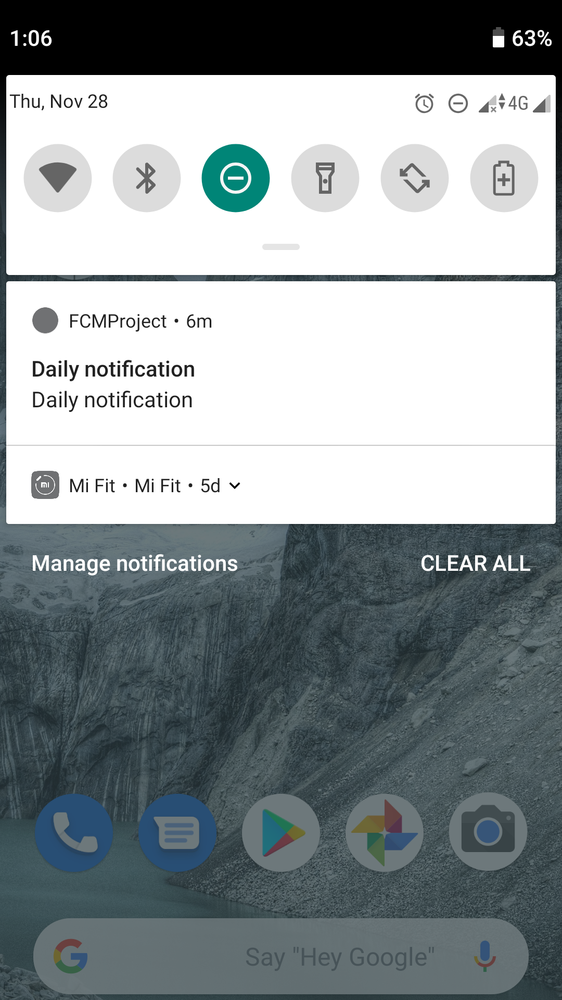

# Note
currently notification is only available on react-native-firebase version 5 and not implemented on version 6

# Create react native project
```bash
npx react-native init FCMProject
npx react-native run-android (adb devices)
npx react-native start
```

# Install & link react-native-firebase
```bash
npm install --save react-native-firebase
react-native link react-native-firebase
```

# Create Firebase project
# Register react native app with Firebase as an Android app
-  package name (application ID) find this package name in your module (app-level) Gradle file, usually app/build.gradle
-  Download google-services.json and Move it into android/app/google-services.json
# Add Firebase Module
-  add the google-services plugin to your Gradle files
--  in the project level build.gradle file
```text
buildscript {

  repositories {
    // Check that you have the following line (if not, add it):
    google()  // Google's Maven repository
  }

  dependencies {
    // ...

    // Add the following line:
    classpath 'com.google.gms:google-services:4.3.3'  // Google Services plugin
  }
}

allprojects {
  // ...

  repositories {
    // Check that you have the following line (if not, add it):
    google()  // Google's Maven repository
    // ...
  }
}
```
-- In your module (app-level) Gradle file (usually app/build.gradle), add a line to the bottom of the file.
```
apply plugin: 'com.google.gms.google-services'
```
- Add Firebase SDK  in the android/app/build.gradle file:
```
dependencies {
  // This should be here already
  implementation project(':react-native-firebase')

  // Firebase dependencies
  implementation "com.google.android.gms:play-services-base:16.1.0"
  implementation "com.google.firebase:firebase-core:16.0.9"

  ...
```
- Using with Proguard enabled
  update your proguard-rules.pro file (android/app/proguard-rules.pro) to include the following lines:
```
-keep class io.invertase.firebase.** { *; }
-dontwarn io.invertase.firebase.**
```
- Run your app to verify installation (from Add Firebase to your Android app)
# Add Firebase Cloud Messaging module (installing on Android)
- Add the dependency
Add the Firebase Cloud Messaging dependency and optional ShortcutBadger dependency to android/app/build.gradle:
```
dependencies {
  // ...
  implementation "com.google.firebase:firebase-messaging:18.0.0"
  implementation 'me.leolin:ShortcutBadger:1.1.21@aar' // <-- Add this line if you wish to use badge on Android
}
```
- Install the RNFirebase Messaging package
Add the RNFirebaseMessagingPackage to your android/app/src/main/java/com/[app name]/MainApplication.java:
```
import com.facebook.react.ReactApplication;
import io.invertase.firebase.messaging.RNFirebaseMessagingPackage; // <-- Add this line

public class MainApplication extends Application implements ReactApplication {
    // ...

    @Override
    protected List<ReactPackage> getPackages() {
      @SuppressWarnings("UnnecessaryLocalVariable")
      List<ReactPackage> packages = new PackageList(this).getPackages();
      // Packages that cannot be autolinked yet can be added manually here, for example:
      // packages.add(new MyReactNativePackage());
      packages.add(new RNFirebaseMessagingPackage()); // <-- Add this line
      return packages;
    }
  };
  // ...
}
```
- Update Android Manifest( android/app/src/main/AndroidManifest.xml)
Within the application component, add the messaging service:
```
<application ...>

  <service android:name="io.invertase.firebase.messaging.RNFirebaseMessagingService">
    <intent-filter>
      <action android:name="com.google.firebase.MESSAGING_EVENT" />
    </intent-filter>
  </service>

</application>
```
If you want to be able to react to data-only messages when your app is in the background, e.g. to display a heads up notification, then you need to add the following to
```
<application ...>
  <service android:name="io.invertase.firebase.messaging.RNFirebaseBackgroundMessagingService" />
</application>
```
- Smoke test: 
-- update App.js
```
import React, { Component } from 'react';
import { Text, View } from 'react-native';

import firebase from 'react-native-firebase';

export default class App extends Component {
  componentWillMount(){
    firebase.messaging().getToken()
    .then(fcmToken => {
      if (fcmToken) {
        console.log('11:fcmToken=',fcmToken);
      } else {
        console.log('13:No token');
      } 
    });
  }
  componentDidMount() {
    this.onTokenRefreshListener = firebase.messaging().onTokenRefresh(fcmToken => {
      // Process your token as required
      console.log('20:fcmToken=',fcmToken);
    });
  }
  componentWillUnmount() {
    this.onTokenRefreshListener();
  }
  render() {
    return (
      <View style={{ flex: 1, justifyContent: "center", alignItems: "center" }}>
        <Text>Hello, world!</Text>
      </View>
    );
  }
}

```
-- Check that you get the FCM token
```bash
npx react-native run-android
npx react-native start
```
# Add Notification module (installing on Android)
- Install the RNFirebase Notifications package
Add the RNFirebaseNotificationsPackage to your android/app/src/main/java/com/[app name]/MainApplication.java:
```
// ...
import com.facebook.react.ReactApplication;
import io.invertase.firebase.notifications.RNFirebaseNotificationsPackage; // <-- Add this line

public class MainApplication extends Application implements ReactApplication {
    // ...

    @Override
    protected List<ReactPackage> getPackages() {
      @SuppressWarnings("UnnecessaryLocalVariable")
      List<ReactPackage> packages = new PackageList(this).getPackages();
      // Packages that cannot be autolinked yet can be added manually here, for example:
      // packages.add(new MyReactNativePackage());
      packages.add(new RNFirebaseNotificationsPackage()); // <-- Add this line
      return packages;
    }
  };
  // ...
}
```
- Update Android Manifest: Add the following to android/app/src/main/AndroidManifest.xml:

   - Add permissions:
```
<manifest ...>
  <uses-permission android:name="android.permission.INTERNET" />
  <uses-permission android:name="android.permission.RECEIVE_BOOT_COMPLETED" />
  <uses-permission android:name="android.permission.VIBRATE" />
```
   - Set app launch mode inside activity props:
```
<activity
  ...
  android:launchMode="singleTop"
>
```
* Smoke test
  * Set the app in background mode
  * Send a message from ```Compose notification```
     * Step notification: Set the Notification title and Notification text and click Next
     * Step target: select app com.fcmproject
     * Click Review button
     * Click Publish button
  * You will see notification pop up in your phone!!!
    
